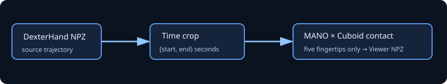

# DexterHand Contact Extractor

DexterHand人类演示数据接触点提取工具：按时间区间裁剪演示轨迹，使用SDF算法提取手指末端与的接触点；输出一段新的包含接触信息的轨迹.NPZ；可由DexterCap Rerun Viewer打开查看 




## 功能

- 用 `--start` / `--end`（秒，`[start, end)`）裁剪所有帧对齐轨迹字段。
- 只输出 `thumb3`、`index3`、`middle3`、`ring3`、`pinky3` 五个末端指节接触；手腕、手掌、MCP 与 PIP 的接触自动忽略。
- 用 MANO 网格和解析 Cuboid SDF 提取接触：保留距离表面 `[0, 2 mm)` 的末端顶点与跨越表面的网格边。
- 输出显式 object-local 接触目标，同时写入 DexterCap 兼容的 world-frame 接触标记。
- 通过 DexterCap 的 Rerun Viewer 可视化裁剪后的手、物体和红色接触点。

当前版本仅支持 **right-hand MANO** 和 metadata 中提供 `object_size` 的轴对齐 Cuboid。它不是通用三角网格碰撞器。

## 先配置 DexterCap 环境与可视化
本机已验证的组合是 DexterCap 的 `HandMocap` 环境。先安装 DexterCap（其中 MANO 模型受其自身许可约束，不能提交到本仓库）：
```bash
git clone https://github.com/PKU-MoCCA/dextercap.git ~/projects/dextercap
cd ~/projects/dextercap
conda create -n HandMocap python=3.10 -y
conda activate HandMocap
pip install -r requirements.txt
```
按 DexterCap 的说明把 `MANO_RIGHT.pkl` 放到：
~/projects/dextercap/HandReconstruction/Data/HumanModels/mano/MANO_RIGHT.pkl
```
## 裁剪、提取并输出演示轨迹

时间窗口左闭右开。帧边界与 DexterCap Viewer 一致，均使用 `ceil(seconds × fps)`：
```bash
conda run -n HandMocap dexterhand-contact-extractor extract \
  --input /data/Cuboid_02-fps_60-right.npz \
  --start 2.0 --end 6.5 \
  --output /path/file.npz
  --mano-model-path "$MANO_MODEL_PATH" \
```
未指定 `--output` 时，文件自动写入本项目的/output/

输出 metadata 记录 `source_frame_start`、`source_frame_stop` 与实际处理方法。关键字段为：

| Field | Shape | Meaning |
| --- | --- | --- |
| `contact_target_points_object_local` | `[T, 5, 3]` | 每根末端手指的 Cuboid 表面目标；无效时为 `NaN` |
| `contact_target_valid` | `[T, 5]` | 接触是否有效，顺序固定为 thumb → pinky |
| `contact_target_feature_mask` | `[T, 5, 6]` | `(+x,-x,+y,-y,+z,-z)` 表面特征 |
| `contact_points_object`, `contact_valid` | `[T, 5, 3]`, `[T, 5]` | DexterCap Viewer 兼容的 world-frame 标记 |

## 可视化结果

该命令会调用 DexterCap 已有的 Rerun viewer；红点就是新输出的接触标记：

```bash
conda run -n HandMocap dexterhand-contact-extractor visualize \
  --input /data/Cuboid_02-contact-2.0-6.5s.npz \
  --dextercap-root "$DEXTERCAP_ROOT"
```
也可直接调用 DexterCap：

```bash
PYTHONPATH="$DEXTERCAP_ROOT" conda run -n HandMocap python \
  "$DEXTERCAP_ROOT/Dataset/visualize.py" \
  --data_path /data/Cuboid_02-contact-2.0-6.5s.npz --hand_side right
```

